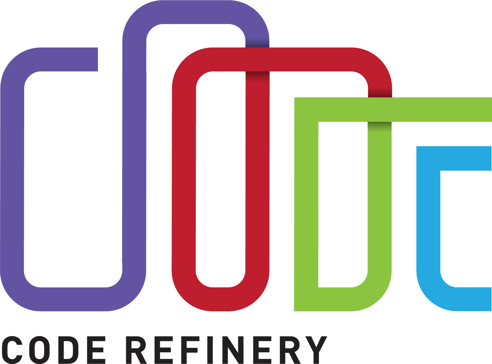

class: center, middle, gray-background

# Practical software licensing

## Radovan Bast

### UiT The Arctic University of Norway


&nbsp;


Text: CC-BY 4.0

Slides: https://bit.ly/practical-software-licensing

---

.left-column30[
## About me


]

.right-column70[
- Theoretical chemist turned research software engineer.

- I write research software and teach programming to researchers and lead the
  [CodeRefinery project](https://coderefinery.org).

- I lead the [high-performance computing group](https://hpc.uit.no) and the
  [research software engineering group](https://research-software.uit.no) at UiT.

- Drafted a [Research software licensing guide](https://research-software.uit.no/blog/2023-software-licensing-guide/)

.quote[I am not a lawyer. This is not a legal advice ...]
]

---

.left-column60[
# Copyright

- .emph[creative expression] -> copyright

- idea -> patents

- name -> trademark

Copyright controls whether and how we can distribute
the original work or the .emph[derivative work].

In the **context of software** it is more about
being able to change and .emph[distribute changes].
]

.right-column30[


.cite[Midjourney, CC-BY-NC 4.0]
]

---

.left-column70[
# Sampling/remixing

- Changing and distributing software is similar to changing and distributing
  music
- You can do almost anything if you don't distribute it


### Often we don't have the choice

- We are expected to publish software
- Sharing can be good insurance against being locked out


### Can we distribute our changes?

- ... with the research community or our future selves?
- .emph[Derivative work]
- Now it matters to look at licenses
]

.right-column30[


.cite[Midjourney, CC-BY-NC 4.0]
]

---

# Why software licenses matter

You find some great code or data that you want to reuse for your own publication.

- This is good for the original author - you will cite them. Maybe other people who cite you will cite them.

- You modify and remix the code.

- Two years later ... &#8987;

- Time to publish: You realize **there is no license to the original work** &#128561;

---

# Now we have a problem

### &#128556; "Best" case: You manage to publish the paper without the software/data

Others cannot build on your software and data.

### &#128561; Worst case: You cannot publish it at all

Journal requires that papers should come with data and software so that they are reproducible.

---

.left-column70[
# Derivative work?

- Download some code from a website and add on to it:
  .quote[[ ] yes [ ] no]
- Download some code and use one of the functions in your code:
  .quote[[ ] yes [ ] no]
- Rewriting code you got from somewhere to a different language:
  .quote[[ ] yes [ ] no]
- Linking to libraries (static or dynamic), plug-ins, and drivers:
  .quote[[ ] yes [ ] no]
- You read a paper, understand algorithm, write own code:
  .quote[[ ] yes [ ] no]
- Clean room design (somebody explains you the code but you have never seen it):
  .quote[[ ] yes [ ] no]
]

.right-column30[


.cite[Midjourney, CC-BY-NC 4.0]
]

---

.left-column70[
# Derivative work?

- Download some code from a website and add on to it:
  .quote[[x] yes [ ] no]
- Download some code and use one of the functions in your code:
  .quote[[x] yes [ ] no]
- Rewriting code you got from somewhere to a different language:
  .quote[[x] yes [ ] no]
- Linking to libraries (static or dynamic), plug-ins, and drivers:
  .quote[[ ] yes [x] no]
- You read a paper, understand algorithm, write own code:
  .quote[[ ] yes [x] no]
- Clean room design (somebody explains you the code but you have never seen it):
  .quote[[ ] yes [x] no]
]

.right-column30[


.cite[Midjourney, CC-BY-NC 4.0]
]

---

# Software license types (metaphor: cake)

.left-column50[


## Your recipe (code)

- Imagine you (.emph[original author]) compose a recipe for a really tasty cake.
- In regular intervals you distribute cakes (release binaries).
- You share it on GitHub under the OpenCake organization.

]

.right-column50[


## Famous restaurant ...

- Finds your cake recipe on GitHub
- The chef suggests improvements (.emph[derivative work]).
- They wish to put it on their menu (.emph[distribution]).
]

.cite[Images: [EmojiOne](https://www.emojione.com), CC-BY-SA 4.0]

---

## Possible outcomes 1/4: custom/proprietary

### No license or custom license

- No restaurant chef will touch it: too much hassle to employ a lawyer to be sure
  that the cake can be served to customers.
- But maybe they will bake it and eat it and not distribute it and that is OK
  ("fair use" provision permits the making of copies for own use).

<!--- The restaurant industry is infamous for copying recipes and there are
very few published court cases. Let's skim over this fact and stay in the
fictitious example though. -->

---

## Possible outcomes 2/4: permissive

### License: MIT or Apache or BSD-2

- It is OK to use the recipe and sell the cake.
- It is OK to not share the improved recipe.
- They have to .emph[indicate where the original recipe came from (preserve copyright notice)]
  and possibly summarize their modifications.
- If somebody becomes sick, it is not the fault of the OpenCake organization (limit of liability).
- You may not get the improvements back to use yourself.

### License: BSD-3

- In addition to the above it is understood that the updated recipe are not endorsed by the OpenCake organization.

---

## Possible outcomes 3/4: share-alike, weak copyleft

### License: GNU Lesser GPL (LGPL)

- The restaurant has to share only the improved cake recipe .emph[but can keep other recipes closed].
- .emph[You can use their improved recipe] and improve it further:


- The restaurant guests have to be able to exchange the cake from the menu by improved cakes from other restaurants (dynamic relinking).

### License: Mozilla Public License v2.0

- Like LGPL but do not require that the modified cake can be exchanged by the restaurant guest.

---

## Possible outcomes 4/4: strong copyleft

### License: GNU GPL or GNU Affero GPL

- If the cake is a part of the menu, the famous restaurant has to
  .emph[share the recipes of the entire menu].

---


.cite[European Commission, Directorate-General for Informatics, Schmitz, P., European Union Public Licence (EUPL): guidelines July 2021, Publications Office, 2021, https://data.europa.eu/doi/10.2799/77160]

---

## Guidelines/recommendations from various universities

- [Aalto university](https://www.aalto.fi/en/open-science-and-research/opening-your-software-at-aalto-university)
    - Summary: yes, you can open software and data and you need to ask only
      minimal permission (confirm your supervisor agrees).
- [UiT](https://en.uit.no/research/innovation/art?p_document_id=754152)
    - "Work results of a copyright nature belong to the author"
- [NTNU](https://i.ntnu.no/wiki/-/wiki/English/Guidelines+for+policy+for+Open+Science)
    - "Where no overriding guidelines exist, NTNU-produced software must be
      licensed under the European Union Public Licence."
- [UiB](https://www.uib.no/en/ub/106619/copyright-own-scientific-work)
    - "As a rule authors have copyright to their own work"
    - Encourage the use of CC-BY
- [UiO](https://www.uio.no/english/for-employees/support/research/funding/units/hf/imv/data-ethics/ipr.html)
    - "If the University chooses not to take steps to secure copyright
      protection and exploit the findings, the employees must be entitled to
      have these rights reassigned to them."

---

.left-column50[
### Beginning of a project


.cite[Midjourney, CC-BY-NC 4.0]

- License does not seem important
- Easy to change (*)
- **Start with a LICENSE file**
]

.right-column50[
### Later in the project


.cite[C.Stadler/Bwag, CC-BY-SA 4.0]

- Can be important
- Especially when combining codes or organizations
- Difficult to change
- Authors change affiliation
]

---

## If your work is not derivative work - you started from scratch

Clarify:
- Does your work contract, grant, or collaboration agreement dictate a
  specific license?
- Is there an intent to commercialize the code?
- When there is unknown or mixed ownership: If there are multiple persons or
  organizations as owners of the code, all must agree to the license.

Do not invent your own license. Choose one of the standard licenses, otherwise
compatibility is not clear:
  - [Joinup Licensing Assistant - Find and compare software licenses](https://joinup.ec.europa.eu/collection/eupl/solution/joinup-licensing-assistant/jla-find-and-compare-software-licenses)
  - [Joinup Licensing Assistant - Compatibility Checker](https://joinup.ec.europa.eu/collection/eupl/solution/joinup-licensing-assistant/jla-compatibility-checker)

If no overriding guidelines exist, we recommend:
- **European Union Public Licence, Version 1.2 or later (EUPL)**
- **MIT License**

---

## If your work is derivative work

**Check the license of the
original code**. Depending on the license, your choices might be limited:
- [Joinup Licensing Assistant - Find and compare software licenses](https://joinup.ec.europa.eu/collection/eupl/solution/joinup-licensing-assistant/jla-find-and-compare-software-licenses)
- [Joinup Licensing Assistant - Compatibility Checker](https://joinup.ec.europa.eu/collection/eupl/solution/joinup-licensing-assistant/jla-compatibility-checker)

If the original code does not have a license, you may not be able to distribute your
derivative code.
- Try to contact the authors and ask them to clarify
  the license of their code.

---

## Receiving contributions

- Keep track of where things come from. Clarify their license.

- **Work as if the repo is public even though it is still private**:
  This is to avoid surprises about code in the history with incompatible
  license years later when we decide to open the project.

- Open core: You don't have to open source all your work. Core can be open
  and on a public branch. The unpublished stuff can be on a private repository.

---

class: center, middle, gray-background

# Software licenses, software citation, and academic credit are not the same thing

---

# Software citation

- Get a [DOI](https://en.wikipedia.org/wiki/Digital_object_identifier) using
  [Zenodo](https://zenodo.org) or [Dataverse](https://dataverse.no/) or similar services.
- Open source license can't demand citation, but it is required by science ethics anyway.
- Make it as easy as possible! Clearly say what you want cited.
- Make it easy for scripts and tools, use the [Citation File Format](https://citation-file-format.github.io).
- [GitHub now supports CITATION.cff files](https://docs.github.com/en/repositories/managing-your-repositorys-settings-and-features/customizing-your-repository/
about-citation-files)

This is an example of a simple `CITATION.cff` file:
```yaml
cff-version: 1.2.0
message: "If you use this software, please cite it as below."
authors:
  - family-names: Druskat
    given-names: Stephan
    orcid: https://orcid.org/1234-5678-9101-1121
title: "My Research Software"
version: 2.0.4
identifiers:
  - type: doi
    value: 10.5281/zenodo.1234
date-released: 2021-08-11
```

---

## Slides: https://bit.ly/practical-software-licensing

- [More about licenses](https://coderefinery.github.io/social-coding/software-licensing/#great-resources)

- [More about software citation](https://coderefinery.github.io/social-coding/software-citation/)

- [Research software licensing guide](https://research-software.uit.no/blog/2023-software-licensing-guide/)

.left-column50[


https://coderefinery.org
]

.right-column50[


https://research-software.uit.no
]
