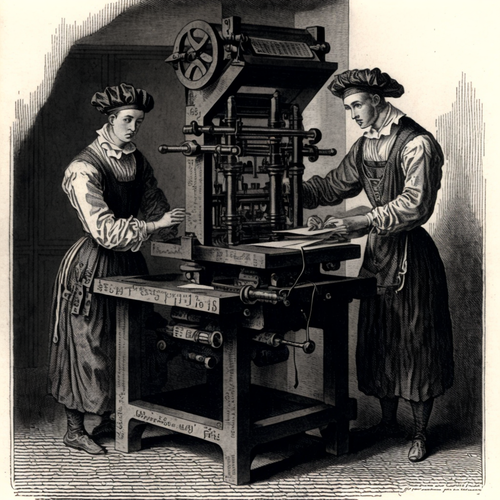

class: center, middle, gray-background

# Practical software licensing

## Radovan Bast ([fosstodon.org/@radovan](https://fosstodon.org/@radovan))

### UiT The Arctic University of Norway


&nbsp;


Text: CC-BY 4.0

Slides: https://bit.ly/practical-software-licensing

---

# About me

.left-column30[

]

.right-column70[
- Theoretical chemist turned research software engineer.

- I write research software and teach programming to researchers and lead the
  [CodeRefinery project](https://coderefinery.org).

- I lead the [high-performance computing group](https://hpc.uit.no) and the
  [research software engineering group](https://research-software.uit.no) at UiT.

.quote[I am not a lawyer. This is not a legal advice ...]
]

---

# Goals

- Connect software licenses to FAIR principles

- .emph[Practical recommendations] for starting, contributing, reusing

- Practical recommendations for individuals, projects, group leads

- Help you navigating and deciding


## Not our goals

- Finding out which license is the best: it depends
- Remembering all the licenses
- Going into legal details
- Ideological aspects

---

# FAIR principles and software

Researchers need to navigate many tools and concepts.


.cite[(c) [Scriberia](http://www.scriberia.co.uk) for [The Turing Way](https://the-turing-way.netlify.com), CC-BY]

---


.cite[Heidi Seibold, CC-BY 4.0, https://twitter.com/HeidiBaya/status/1579385587865649153]

---

.left-column50[
### Beginning of a project


.cite[Midjourney, CC-BY-NC 4.0]

- License does not seem important
- Easy to change (*)
]

.right-column50[
### Later in the project


.cite[C.Stadler/Bwag, CC-BY-SA 4.0]

- Can be important
- Especially when combining codes or organizations
- Difficult to change
- Authors change affiliation
]

---

.left-column70[
# Copyright

- .emph[creative expression] -> copyright
- idea -> patents
- name -> trademark

Copyright controls whether and how we can distribute
the original work or the derivative work
- "distribute-right"
- "change-right"

Code that we write is automatically protected by copyright practically
"forever" (lifetime of author + 70 years).
- (c) who exactly, though?
]

.right-column30[



.cite[Midjourney, CC-BY-NC 4.0]
]

---

.left-column70[
# Sampling/remixing

- Changing and distributing software is similar to changing and distributing
  music
- You can do almost anything if you don't distribute it


### Often we don't have the choice

- We are expected to publish software
- Sharing can be good insurance against being locked out


### Can we distribute our changes?

- ... with the research community or our future selves?
- .emph[Derivative work]
- Now it matters to look at licenses
]

.right-column30[


.cite[Midjourney, CC-BY-NC 4.0]
]

---

.left-column70[
# Derivative work?

- Download some code from a website and add on to it:
  .quote[[ ] yes [ ] no]
- Download some code and use one of the functions in your code:
  .quote[[ ] yes [ ] no]
- Rewriting code you got from somewhere to a different language:
  .quote[[ ] yes [ ] no]
- Linking to libraries (static or dynamic), plug-ins, and drivers:
  .quote[[ ] yes [ ] no]
- You read a paper, understand algorithm, write own code:
  .quote[[ ] yes [ ] no]
- Clean room design (somebody explains you the code but you have never seen it):
  .quote[[ ] yes [ ] no]
]

.right-column30[


.cite[Midjourney, CC-BY-NC 4.0]
]

---

class: center, middle, inverse

# .quote["It depends"]

---

.left-column70[
# Derivative work?

- Download some code from a website and add on to it:
  .quote[[x] yes [ ] no]
- Download some code and use one of the functions in your code:
  .quote[[x] yes [ ] no]
- Rewriting code you got from somewhere to a different language:
  .quote[[x] yes [ ] no]
- Linking to libraries (static or dynamic), plug-ins, and drivers:
  .quote[[ ] yes [x] no]
- You read a paper, understand algorithm, write own code:
  .quote[[ ] yes [x] no]
- Clean room design (somebody explains you the code but you have never seen it):
  .quote[[ ] yes [x] no]
]

.right-column30[


.cite[Midjourney, CC-BY-NC 4.0]
]

---

# Software license types (metaphor: cake)

.left-column50[


## Your recipe (code)

- Imagine you (.emph[original author]) compose a recipe for a really tasty cake.
- In regular intervals you distribute cakes (release binaries).
- You share it on GitHub under the OpenCake organization.

]

.right-column50[


## Famous restaurant ...

- Finds your cake recipe on GitHub
- The chef suggests improvements (.emph[derivative work]).
- They wish to put it on their menu (.emph[distribution]).
]

.cite[Images: [EmojiOne](https://www.emojione.com), CC-BY-SA 4.0]

---

## Possible outcomes 1/4: custom/proprietary

### No license or custom license

- No restaurant chef will touch it: too much hassle to employ a lawyer to be sure
  that the cake can be served to customers.
- But maybe they will bake it and eat it and not distribute it and that is OK
  ("fair use" provision permits the making of copies for own use).

<!--- The restaurant industry is infamous for copying recipes and there are
very few published court cases. Let's skim over this fact and stay in the
fictitious example though. -->

---

## Possible outcomes 2/4: permissive

### License: MIT or Apache or BSD-2

- It is OK to use the recipe and sell the cake.
- It is OK to not share the improved recipe.
- They have to .emph[indicate where the original recipe came from (preserve copyright notice)]
  and possibly summarize their modifications.
- If somebody becomes sick, it is not the fault of the OpenCake organization (limit of liability).
- You may not get the improvements back to use yourself.

### License: BSD-3

- In addition to the above it is understood that the updated recipe are not endorsed by the OpenCake organization.

---

## Possible outcomes 3/4: share-alike, weak copyleft

### License: GNU Lesser GPL (LGPL)

- The restaurant has to share only the improved cake recipe .emph[but can keep other recipes closed].
- .emph[You can use their improved recipe] and improve it further:


- The restaurant guests have to be able to exchange the cake from the menu by improved cakes from other restaurants (dynamic relinking).

### License: Mozilla Public License v2.0

- Like LGPL but do not require that the modified cake can be exchanged by the restaurant guest.

---

## Possible outcomes 4/4: strong copyleft

### License: GNU GPL or GNU Affero GPL

- If the cake is a part of the menu, the famous restaurant has to
  .emph[share the recipes of the entire menu].

---

### Custom/closed/proprietary

- .emph[Derivative work typically not possible]


### Permissive

- You .emph[may lose access to derivative work]
- Attractive for companies with proprietary software


### Share-alike, weak copyleft

- You can reuse .emph[their changes to your component]
- Compatible with proprietary software


### Strong copyleft

- You can reuse and further change .emph[the combined derivative work]
- Not attractive for companies with proprietary software

---

# Ownership (1/2)

### Who owns the copyright for software you write?

- Intellectual property .emph[depends on the country and the employer] ("works made for hire")


### Who can decide about or change a license?

- The copyright holder if a separate "Contributor License Agreement" is signed.
- Otherwise consent from all contributors.

---

# Ownership (2/2)

### If you own your software:

- You can change the license.
- You can dual-license (e.g. GPL for anyone, but you can pay for commercial non-GPL).


### If you do not own your software, you can:

- Request open-sourcing directly (preserves your rights).
- Request a transfer of ownership (check with your university).


### If you accept contributions (pull requests), you may not be the only owner anymore!

- Clarify licensing strategy early in the project.

---

# Guidelines/recommendations from various universities

- [Aalto university](https://www.aalto.fi/en/open-science-and-research/opening-your-software-at-aalto-university)
    - Summary: yes, you can open software and data and you need to ask only
      minimal permission (confirm your supervisor agrees).
- [UiT](https://en.uit.no/research/innovation/art?p_document_id=754152)
    - "Work results of a copyright nature belong to the author"
- [NTNU](https://i.ntnu.no/wiki/-/wiki/English/Guidelines+for+policy+for+Open+Science)
    - "Where no overriding guidelines exist, NTNU-produced software must be
      licensed under the European Union Public Licence."
- [UiB](https://www.uib.no/en/ub/106619/copyright-own-scientific-work)
    - "As a rule authors have copyright to their own work"
    - Encourage the use of CC-BY
- [UiO](https://www.uio.no/english/for-employees/support/research/funding/units/hf/imv/data-ethics/ipr.html)
    - "If the University chooses not to take steps to secure copyright
      protection and exploit the findings, the employees must be entitled to
      have these rights reassigned to them."

---

# Practical recommendations (1/3)

### Starting a new project

- License your code **very early** in the project.
- **You cannot ignore licensing**: default is "no one can make derivative works".
- Start with a `README.md` and a `LICENSE` file.
- A great resource on what to include in a `README.md`
  are the [JOSS paper review criteria](https://joss.readthedocs.io/en/latest/review_criteria.html).
- Add also the files `CONTRIBUTING.md` and `CODE_OF_CONDUCT.md` (see [Mozilla
  Introduction to Contributor
  Guidelines](https://mozilla.github.io/open-leadership-training-series/articles/building-communities-of-contributors/write-contributor-guidelines/),
  [good example](https://github.com/KirstieJane/STEMMRoleModels)).


### Even before starting

- Emphasize the open source nature of the code output in your research
  proposal.
- Agree on license that works for all project partners.

---

### Choice of license

- Take an [OSI](https://opensource.org/licenses)-approved license: makes it easier to evaluate
  [compatibility](https://en.wikipedia.org/wiki/License_compatibility).
- **Do not design your own custom licenses** for open source/ open use: compatibility not clear.


### Contributing

- Don't lock yourself out of your own code. Clarify the license.


### Receiving contributions

- Keep track of where things come from. Clarify their license.
- **Work as if the repo is public even though it is still private**:
  This is to avoid surprises about code in the history with incompatible
  license years later when we decide to open the project.
- Open core: You don't have to open source all your work. Core can be open
  and on a public branch. The unpublished stuff can be on a private repository.

---

# Practical recommendations (3/3)

### Open-sourcing code

- Clarify ownership.
- Identify all contributors.
- Agree on license.
- Ask all contributors whether they agree to a license change.
- If somebody disagrees, their contribution needs to be taken out.
- Code with incompatible license may need to be taken out.
- Often it is useful to share the code history: then history needs to be
  cleaned up (`git filter-branch`).
- In any legal dispute, one will look at code history (another reason to use
  version control). A big code base without any history will look suspicious.

---

# Examples

- **Rust compiler and many public crates**: dual-licensed under Apache 2.0 and MIT
- **React** (Facebook): switched from custom "BSD+Patents" to MIT
- **TensorFlow**: Apache 2.0
- **Pandas**: BSD-3
- **FFmpeg**: LGPL v2.1+
- **Emacs**: GPL
- **Linux kernel**: GPL


### Recommendation

- Compare license of codes that you depend on and that might depend on you.

---

.left-column50[


.cite[Shaddim; original symbols: Creative Commons, CC-BY 4.0]
]

.right-column50[
# How about data?

Differences:
- ND: you may not distribute modified material
- NC: non-commercial


## ... and back to software:

Ethical licenses for open source:
- https://ethicalsource.dev/licenses/
]

---

## Licensing and machine learning/ AI

### Is it data? Is it software?

We need to consider the AI solution, the training data, the production data,
the AI output, and AI evolutions.


### How about ethics? How about liability?

- [EU AI Act](https://artificialintelligenceact.eu/)
- Models can be reverse-engineered and training data can be extracted
- What if the model generates an outcome that is dangerous?
.cite[Thanks to E. Glerean for pointing these issues out to me]


### Some resources

- [RAIL initiative: "Responsible AI licenses"](https://www.licenses.ai)
- [The Turing Way: Machine Learning Model Licenses](https://the-turing-way.netlify.app/reproducible-research/licensing/licensing-ml.html)
- ["Expert Q&A on Artificial Intelligence (AI) Licensing"](https://www.mayerbrown.com/-/media/files/news/2019/01/expert-qanda-on-artificial-intelligence-ai-licensing-w0219801.pdf)

---

class: center, middle, gray-background

# Software licenses, software citation, and academic credit are not the same thing

---

# Software citation

- Get a [DOI](https://en.wikipedia.org/wiki/Digital_object_identifier) using
  [Zenodo](https://zenodo.org) or [Dataverse](https://dataverse.no/) or similar services.
- Open source license can't demand citation, but it is required by science ethics anyway.
- Make it as easy as possible! Clearly say what you want cited.
- Make it easy for scripts and tools, use the [Citation File Format](https://citation-file-format.github.io).
- [GitHub now supports CITATION.cff files](https://docs.github.com/en/repositories/managing-your-repositorys-settings-and-features/customizing-your-repository/
about-citation-files)

This is an example of a simple `CITATION.cff` file:
```yaml
cff-version: 1.2.0
message: "If you use this software, please cite it as below."
authors:
  - family-names: Druskat
    given-names: Stephan
    orcid: https://orcid.org/1234-5678-9101-1121
title: "My Research Software"
version: 2.0.4
doi: 10.5281/zenodo.1234
date-released: 2021-08-11
```

---

## Slides: https://bit.ly/practical-software-licensing

.left-column50[


https://coderefinery.org
]

.right-column50[


https://research-software.uit.no
]


## More about licenses

- https://coderefinery.github.io/social-coding/licensing/#further-reading


## More about software citation

- https://coderefinery.github.io/social-coding/software-citation/#how-to-cite-software
